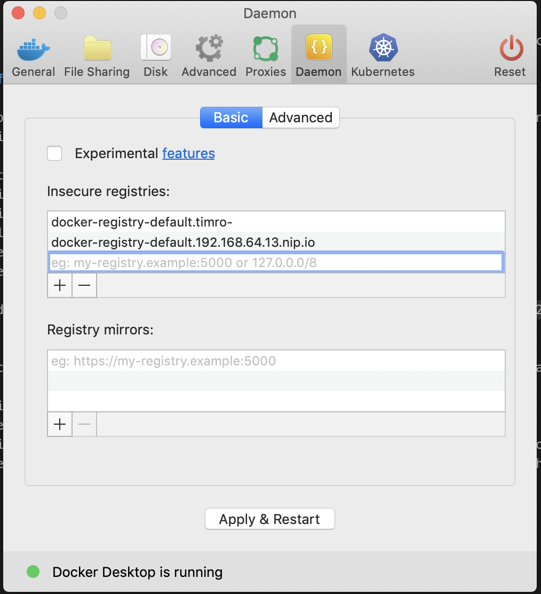

# Deploying Appsody applications to Kubernetes

If you want to "just see" how it works in a cluster, the Appsody CLI supports a path to easily deploy and application to an existing Kubernetes cluster, whether it is locally on the developer workstation or running remotely. The deployment of an application is orchestrated by the [Appdsody Operator](https://github.com/appsody/appsody-operator), that was installed to your Minishift cluster earlier.

If you have a user with `cluster admin` role privileges on a Kubernetes cluster, the deployment of an application can be as simple as running the `appsody deploy` command with a few additional arguments. That's for the general local development design point which is a reasonable assumption for a Kubernetes cluster installed on a developer's workstation.

In our lab, you have a multi-tenant capable Minishift cluster, so to learn a bit more about the internals behind `appsody deploy` we will take a step-by-step approach and learn a little about OpenShift and private container image registries in the process.

## Configuring the docker CLI for access to a private registry

To allow the workstation docker cli to be able to log in to the minishift container registry, you first need to enable an additional minishift addon, the `registry-route` add on. Use these commands:

```text
minishift addon enable registry-route
minishift addon apply registry-route
-- Applying addon 'registry-route':
 -- Create secret directory..
 -- Creating server cert.
...
 -- $ docker login -u developer -p `oc whoami -t` docker-registry-default.192.168.64.13.nip.io
```

> you can make a note of the docker login example command that was provided at the end of the output of the apply for the add-on.

In Minishift, the container registry endpoint uses a private certificate, so you will need to adjust your workstation's Docker preferences to allow access to this insecure registry. The alternative is to grab the certificates and add these to Docker, but since the minishift registry is local to the system, there's really no security gain for the effort.

On MacOS or Windows, open your Docker preferences, select the Daemon tab and add the host provided from enabling the route to the list of insecure registries:



> Apply and restart the Docker engine after the update.

For Linux platforms, you can edit the `/etc/docker/daemon.json` file to add the entry with a syntax like:

```json
{
  "insecure-registries" : ["docker-registry-default.192.168.64.13.nip.io:5000"]
}
```

> Restart Docker for the changes to take effect

With access to the private registry enabled, use the example command to log in to the Minishift container registry as the local developer user:

```text
docker login -u developer -p `oc whoami -t` $(minishift openshift registry)
WARNING! Using --password via the CLI is insecure. Use --password-stdin.
Login Succeeded
```

## Deploying the application - step-by-step

When deploying an application to Kubernetes from the source, there's a fundamental set of 4 essential steps (which can be captured in automation scripts and deployment pipelines). The steps are **build** - where the code is assembled into a container image, **push** - where the container image is sent from the build system to a registry, **create manifest** - where a deployment manifest is created, **deploy** - running the kubectl/oc command to apply the manifest. An example script with these steps is here:

### Build the application into a container

When you're completed with local loop development and ready to deploy your application to a cluster, start by logging in to your cluster as the developer user:

```text
oc login -u developer -p anything
Login successful.
...
```

After loggin in you can create a container image with the command:

```text
appsody build -t $(minishift openshift registry)/$(oc project -q)/mynode:0.1.0
```

This combines the runtime for the appsody stack with your application code creating a container image. The image is tagged so that you can deploy it to the private registry but first, you can test it out running locally if desired:

```text
docker run -it --rm -p 3000:3000 $(minishift openshift registry)/$(oc project -q)/mynode:0.1.0

> nodejs-express@0.2.7 start /project
> node server.js

[Tue Oct 22 18:03:32 2019] com.ibm.diagnostics.healthcenter.loader INFO: Node Application Metrics 5.0.3.201910201906 (Agent Core 4.0.3)
[Tue Oct 22 18:03:33 2019] com.ibm.diagnostics.healthcenter.mqtt INFO: Connecting to broker localhost:1883
App started on PORT 3000
```

Test out the app with `curl http://localhost:3000/foo` or with one of the other health endpoints. Enter **Crtl-C** in the docker terminal to stop the running container.

### Push the container to the Minishift image registry

The `appsody deploy` command will create a CRD for the appsody application that references an image in the internal registry. Of course, any registry where there is network connectivity for the cluster can be used. Push the image:

```text
docker push $(minishift openshift registry)/$(oc project -q)/mynode:0.1.0
```

### Create the deployment yaml

With the image built and pushed to the registry on Minishift, create a deployment file:

```text
appsody deploy --generate-only -t 172.30.1.1:5000/$(oc project -q)/mynode:0.1.0
Pulling docker image appsody/nodejs-express:0.2
Running command: docker pull appsody/nodejs-express:0.2
0.2: Pulling from appsody/nodejs-express
Digest: sha256:36a60fa077a5e38d5275665f666c00f93e64896434d84efe8ebeab87b8c51210
Status: Image is up to date for appsody/nodejs-express:0.2
docker.io/appsody/nodejs-express:0.2
Running command: docker create --name mynode-extract appsody/nodejs-express:0.2
Running command: docker cp mynode-extract:/config/app-deploy.yaml ./app-deploy.yaml
Running command: docker rm mynode-extract -f
Created deployment manifest: app-deploy.yaml
```

### Deploy the application

Apply the configuration to the Minishift cluster in the current project to get the application running:

```text
oc apply -f app-deploy.yaml
```

Check the status of the deployment application pod:

```text
oc get pods
NAME                      READY     STATUS    RESTARTS   AGE
mynode-78bd487665-4n2hv   1/1       Running   0          33s
```

You can look at the running application in the Minishift console using `minishift console` and logging in as the developer user. Or you can just continue with the cli to get the endpoint for the application:

```text
oc get routes
NAME      HOST/PORT                               PATH      SERVICES   PORT       TERMINATION   WILDCARD
mynode    mynode-myproject.192.168.64.13.nip.io             mynode     3000-tcp                 None
```

Test out the route (update with your endpoint from the previous command):

```text
curl http://mynode-myproject.192.168.64.13.nip.io/foo
{"msg":"bar"}
```

> note that with the application exposed by OpenShift - the network endpoint changes from `tcp 3000` to the standard http endpoint. By default this route does not have TLS enabled, but that can be easily enabled as desired.

## Deploying the application - scripted approach

Of course, in practice you don't want to run these commands over and over. Adapting the [Kabanero 101 example](https://ibm-cloud-architecture.github.io/Learning-Kabanero-101/web/1.0.0/appsody-deploy.html) you could run something like this to create a deployment script and associated `.env` file in your appsody project directory:

```bash
cat <<EOF >.env
DOCKER_REGISTRY=$(minishift openshift registry)
NAMESPACE=$(oc project -q)
APP_NAME=${PWD##*/}
IMAGE_NAME=${PWD##*/}
APP_KNATIVE=false
EOF

cat <<EOF >deploy.sh
#!/bin/bash
source .env
IMAGE_TAG=\${RANDOM}

if [ "\$APP_KNATIVE" = "true" ]; then
  echo Deploying Serverless Service
  APP_KNATIVE_FLAG="--knative"
  yq w -i ${APP_DEPLOY_YAML} spec.createKnativeService true
fi

# Step 1 - build the image
appsody build \
  --tag \${DOCKER_REGISTRY}/\${NAMESPACE}/\${IMAGE_NAME}:\${IMAGE_TAG}

# Step 2 - push the image
docker push \${DOCKER_REGISTRY}/\${NAMESPACE}/\${IMAGE_NAME}:\${IMAGE_TAG}

# Step 3 - create deployment manifest
appsody deploy --generate-only --force -t 172.30.1.1:5000/\${NAMESPACE}/\${IMAGE_NAME}:\${IMAGE_TAG}

# Step 4 - deploy the application
oc apply -f app-deploy.yaml

echo "waiting a moment for app route to appear"
sleep 10

if [ "\$APP_KNATIVE" = "true" ]; then
  echo Getting Serveless Application URL...
  APP_URL=\$(oc get ksvc \${APP_NAME} -n \${NAMESPACE} -o jsonpath="{.status.url}")
else
  echo Getting Application URL...
  APP_URL=http://\$(oc get route \${APP_NAME} -n \${NAMESPACE} -o jsonpath="{.spec.host}")
fi

echo App deployed: \${APP_URL}
EOF
chmod +x deploy.sh
```

This script uses a random tag to differentiate between each run. You will see a unique, but not sequential image tag in the container registry for each deployment. This is a simple example, encapsulating the 4 basic steps of deployment and include an option to specify deployment with a serverless model for environments that include Knative.

## Cleaning up

Whether you deployed the application using the manual set of steps or a script. To remove the application, all you need to do is to remove the application resource from `app-deploy.yaml`:

```text
oc delete -f app-deploy.yaml
```
