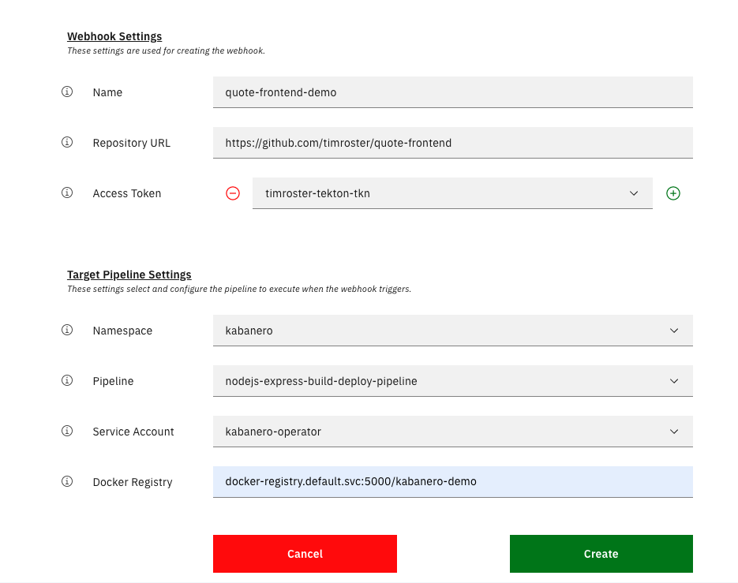

# Using Codewind notes

Exploring a more complex applicaion scenario - just the key steps w/o narrative.

Based on [https://github.com/IBM/appsody-sample-quote-app](https://github.com/IBM/appsody-sample-quote-app) - live exercise to create the front end using Codewind, upload to git repository and deploy using a Kabanero / Tekton pipeline

1. Start VSCode
1. Turn on Codewind
1. View templates
1. Create a Node.js and Express simple application, name it `quote-frontend`
1. Let application start, explore IDE
1. Update the application to add the code - start by disabling the project
1. Update `package.json` to include additional dependencies:

    ```javascript
    ...
    "dependencies": {
    "body-parser": "^1.19.0",
    "config": "^3.2.0",
    "express-validator": "^6.2.0",
    "pug": "^2.0.0",
    "request": "^2.88.0"
     },
     "devDependencies": {
    ...
    ```

1. Update the remaining assets by bulk copy/drag
1. Re-enable project
1. Follow startup in logs
1. Launch Application from IDE
1. Show ROKS environment and deployed backend in kabanero-demo workspace - visit Kabanero / Tekton dashboards
1. Set up the deployment file from terminal in project directory

    ```bash
    appsody deploy --generate-only
    ```

1. Edit the `app-deploy.yaml` file to add in environment variable and set target namespace

    ```yaml
    apiVersion: appsody.dev/v1beta1
    kind: AppsodyApplication
    metadata:
      name: quote-frontend
      namespace: kabanero-demo
    spec:
      # Add fields here
      version: 1.0.0
      applicationImage: dev.local/quote-frontend
      stack: nodejs-express
      env:
      - name: BACKEND_URL
        value: http://quote-backend:8080/quote
      ...
    ```

1. Set up git repository from current directory: git init / navigate to github / create repo / push
1. Go to Tekton dashboard and create new webhook

    

1. Return to git repository, check `Settings -> Webhooks`
1. Make update to application, push commit to repo
1. Go back to Tekton dashboard and watch the magic... Start in PipelineRuns - this is currently taking about 10 minutes to complete. Good time to go through ROKS web UI or handle Q/A
1. Check out the pipeline final status.
1. Go to the project and check pod status.
1. Access application and test
